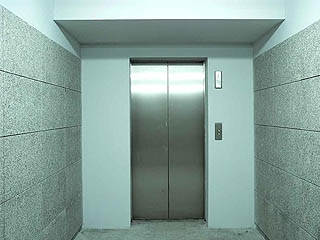
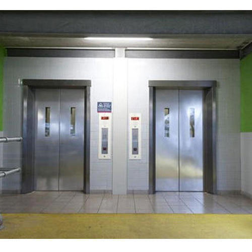
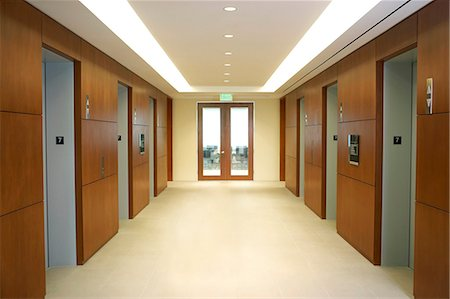
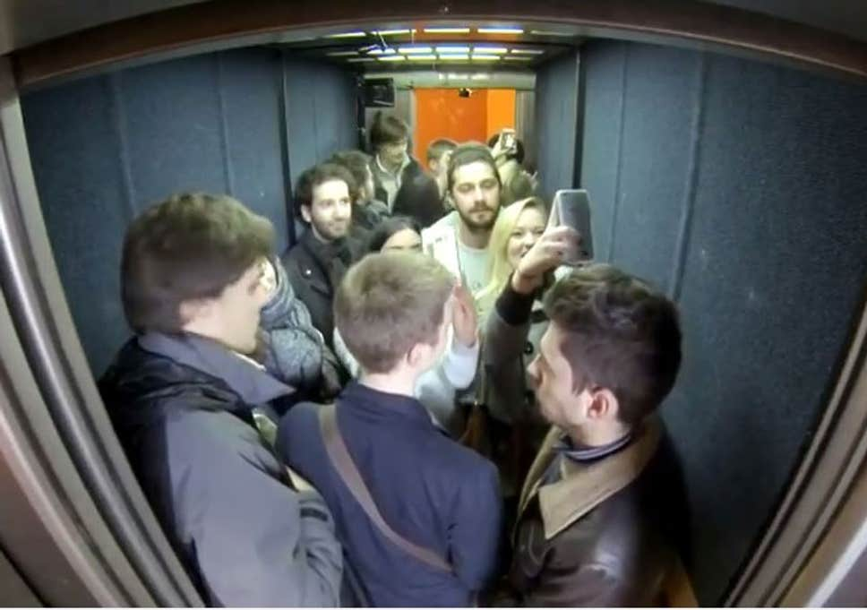

# elevator-challenge
A challenge to solve the elevator problem

# Telling the history
So we need at least some background history to understand this problem, so here we go.

Imagine that you are a kind of a new Startup owner, a ElevatorKrupp Company, and you goal , as a company, is to project
and design a software capable to choose the best option to a person in a determinate floor of a office building.

In this case, you are a new guy in this business and you are trying to figure out how to develop that, so there is more information about that...

# Beginner's challenge

Lets begin with a easy task, here are the challenge context:

- There are a Office Building with 6 floors and 1 elevators.
- There are 1 companies in this building
  - Floor: 5; company 1 (150 employees)
- The elevator's equipament has a way to inform the correct floor you want before call it (a panel with numbers in the building hall).
- The elevator travels at speed 10 floors per minute.
- The elevator maximum capacity is about 820KG (aproximately 12 peoples).
- Think that everyone are on the building hall waiting the elevator are patient, so dont care about the order or queue in the hall.

#### Objectives:

- Show a log of the elevator actions (format as you want, but one action per logs line).
- How much time you will take to travel all the employees to its companies?

# Intermediate challenge

You sucessfully deliver your MVP (Minimun Value Product) and here is the second phase for your company growth:

- There are a Office Building with 10 floors and 2 elevators.
- There are 4 companies in this building
  - Floor: 1-2; company 1 (25 employees in each floor)
  - Floor: 3; company 2 (20 employees)
  - Floor: 5; company 3 (30 employees)
  - Floor: 7-8-9; company 4 (50 employees in each floor)

- The elevator's equipament has a way to inform the correct floor you want before call it (a panel with numbers in the building hall).
- The elevator travels at speed 5 floors per minute.
- The elevator maximum capacity is about 1080KG (aproximately 16 peoples).
- Think that everyone are on the building hall waiting the elevator are patient, so dont care about the order or queue in the hall.
- You can leave some employees on intermediate floor to pickup it later (They are happy with your success).

#### Objectives:

- Show a log of the elevator actions (format as you want, but one action per logs line).
- How much time you will take to travel all the employees to its companies?
- How many travels you made?

# Advanced

Assuming that you will continue, so you are a more succesfuly Startup Owner, and you company grownth without limits. It's now time for your next challenge and a litle more complexcity (some are like the prior phase).

- There are a Office Building with 20 floors and 6 elevators.
- There are 9 companies in this building
  - Floor: 1-2; company 1 (30 employees in each floor)
  - Floor: 3; company 2 (30 employees)
  - Floor: 5; company 3 (40 employees)
  - Floor: 7-8-9; company 4 (50 employees in each floor)
  - Floor: 11-12; company 5 (25 employees in each floor)
  - Floor: 13; company 6 (30 employees)
  - Floor: 14; company 7 (20 employees)
  - Floor: 17; company 8 (100 employees)
  - Floor: 18-19-20; company 9 (50 employees in each floor)
- The elevator's equipament has a way to inform the correct floor you want before call it (a panel with numbers in the building hall).
- The elevator travels at speed of 40 floors per minute.
- The elevator maximum capacity is about 1210KG (aproximately 18 peoples).
- The elevator takes doors time in consideration:
    - 2 seconds opening;
    - 3 seconds waiting passagers entering and leaving;
    - 2 seconds closing the doors.

#### Objectives:

- Show a log of the elevator actions (format as you want, but one action per logs line).
- How much time you will take to travel all the employes to its companies?
- How many travels you made?
- How many time opening, waiting and closing the doors takes?

# Like hell (closest to the reality)

So, now its time to close the reality gap between our software and why do that?
The reason is: when your software are more close to reality, more dificulties you have to simulate and estimate things that you need.

Take as base the Advance stage and do as mucha as you can (there is no limitation what you need to use to accomplish that, just do the best you can).

- There are 6 elevators but only 3 can lift peoples from 0 to 1-10 floor and only 3 elevators can lift peoples from 0 to 11-20.
- There are a problem we need to take in account, every 10 travels it will slowdown the speed to half (traveling at 20 floors per second) to cooldown the Gears. After 5 travels at low speed it recover the full speed (traveling at 40 floors per second).
- Every time we move the elevator to a floor and opening/close we spent energy:
    - 10 kilowatts for opening/closing doors;
    - 600 kilowatts for lifting the elevator for each floor;
    - 500 watts for elevator goes down for each floor;

#### Objectives:

- Show a log of the elevator actions (format as you want, but one action per logs line).
- How much time you will take to travel all the employes to its companies?
- How many travels you made?
- How many time opening, waiting and closing the doors takes?
- How much Kilowatts/hours the elevator will consuming?
