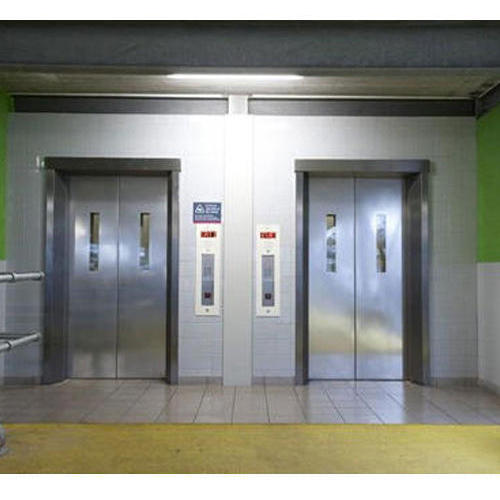
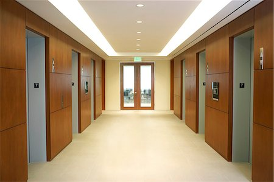

# elevator-challenge
A challenge to solve the elevator problem

# Telling the history
So we need at least some background history to understand this problem, so here we go.

Imagine that you are a kind of a new Startup owner, a ElevatorKrupp Company, and you goal , as a company, is to project
and design a software capable to choose the best option to a person in a determinate floor of a office building.

In this case, you are a new guy in this business and you are trying to figure out how to develop that, so there is more information about that...

# First Scenario

- There are a Office Building with 10 floors and 2 elevators.
- There are 4 companies in this building
  - Floor: 1-2; company 1 (25 employes in each floor)
  - Floor: 3; company 2 (20 employes)
  - Floor: 5; company 3 (30 employes)
  - Floor: 7-8-9; company 4 (50 employes in each floor)

- The elevator's equipament has a way to inform the correct floor you want before call it (a panel with numbers in the building hall).
- The elevator travels at speed 5 floors per minute.
- The elevator maximum capacity is about 1080KG (aproximately 16 peoples).

**How much time you will take to travel all the employes to its companies?**
(think that everyone are on the building hall waiting the elevator, so less time is better.)

Show your code and results.

# Second Scenario

(Do the maximum features as you can)

Assuming that you will continue, so you are a more succesfuly Startup Owner, and you company grownth without limits. It's now time for your next challenge and more complexcity.

- There are a Office Building with 20 floors and 6 elevators.
- There are 9 companies in this building
  - Floor: 1-2; company 1 (30 employes in each floor)
  - Floor: 3; company 2 (30 employes)
  - Floor: 5; company 3 (40 employes)
  - Floor: 7-8-9; company 4 (50 employes in each floor)
  - Floor: 11-12; company 5 (25 employes in each floor)
  - Floor: 13; company 6 (30 employes)
  - Floor: 14; company 7 (20 employes)
  - Floor: 17; company 8 (100 employes)
  - Floor: 18-19-20; company 9 (50 employes in each floor)
- The elevator's equipament has a way to inform the correct floor you want before call it (a panel with numbers in the building hall).
- There are 6 elevators but only 3 can lift peoples from 0 to 1-10 floor and only 3 elevators can lift peoples from 0 to 11-20.
- The elevator travels at speed of 40 floors per minute.
- The elevator maximum capacity is about 1210KG (aproximately 18 peoples).
- The elevator takes 2 seconds opening, 2 seconds waiting and 2 seconds closing the doors.
- There are a problem we need to take in account, every 100 travels it will slowdown the speed to half (traveling at 20 floors per second) to cooldown the Gears. After 10 travels at low speed it recover the full speed (traveling at 40 floors per second).
